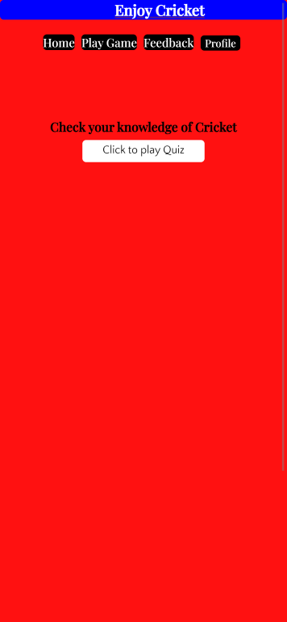

# Enjoy Cricket

The Website provides an online quiz to check cricket knowledge. It consists of three pages, home page provides information about how to play game, Game page provides questions and choices to choose from to check Cricket knowledge and Feedback page to rate the service and submit any suggestion to improve the service. It provies an interactive quiz for Cricket lovers to entertain and at the same time improve their Cricket knowledge. It is made using HTML, CSS and JavaScript.

[Click here](https://zahid295.github.io/Enjoy-cricket/) to view live project website.

## User Experience

### User Stories

##### First time user goals

- As a first time user, I want to know the purpose of website and what it offers.
- As a first time user, I want to play online Cricket quiz to entertain and check my knowledge.
- As a first time user, I want to know, how to play this online quiz.
  
##### Returner user goals

- As a returner user, I want to rate the service.
- As a returner user, I want to give review for suggesting or recommeding somthing to improve the service.
- As a returner user, I want to follow this website on social media to see if there are any updates.

### Design

##### Color Scheme

The main colors used are red, black, blue and white.

- Red may communicate a range of emotions and meanings. It is used for background because it draws attention.
- Black color improves readability. It is used for background of nav bar and also for some headings becasue black can produce an attantion grabing visual effect that will draw users in and this is the main goal of any website.
- Blue color indicates trust and people feel safe with this color. It is used for logo and some headings's background color.
- White has long been associated with purity, timelessness, elegance, and a sense of peacefulness. It is used for some paragraph text beacsue it has good contrast with red.
  
##### Typography

Two types of font are used in the website.

- Quattrocento Sans is used for paragraphs and sans-serif is used if Quattrocento Sans fails to work.
- Playfair Display is used for headings and serif is used if Playfair Display does not function.

### Wireframes

##### Landing Page

##### Play Game Page

##### Feedback page

### Features

- ##### Home page
  
  Home page, provies a clear navigation menu to follow. Below the navigation, guidelines are given that how to play game.
  
  
  
- ##### Play Game page

  It provides a way to play online cricket quiz after hitting click to play game button. As a user select and submit the multiple choice, an alert appears to show wether the selected choice was correct or incorrect and also shows the correct answer. Once all questions are completed, final score will appear and then play again button show up to play again.
  
  

  

  
- ##### Feedback page
  
  This page provides form to rate the service out of 5 ratings. It also shows the review form to give some suggestion or recommendation to improve the service.

  

  
  
### Technologies used

###### Languages

- HTML
- CSS
- JavaScript

##### Frameworks, Libraries and programs used

- [Codeanywhere](https://codeanywhere.com/solutions/collaborate) - Codeanywhere was used as IDE.

- [Google fonts](https://fonts.google.com/) -  Fonts for this website are from Google Fonts.
- [Git](https://git-scm.com/) - Git was used for version control.
- [Github](https://github.com/) - GitHub was used to store project.
- [Balsamiq](https://balsamiq.com/) - Wireframes were made using Balsamiq.
- [Canva](https://www.canva.com/) - Was used for image in the Website.
- [Am i Responsive](https://ui.dev/amiresponsive) - was used to see that site is responsive on different screen sizes. A screenshot is taken from Am I Responsive.
  
### Testing

All pages of the project were validated using the W3C Markup Validator and W3C CSS Validator Services to ensure there were no syntax issues.
  