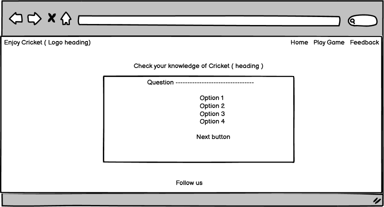
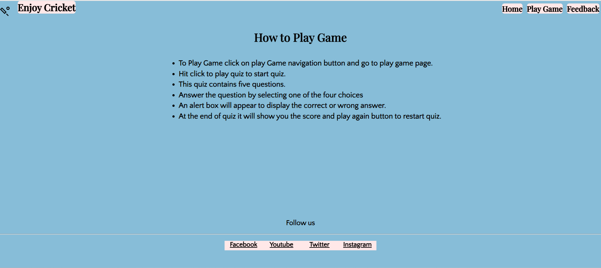
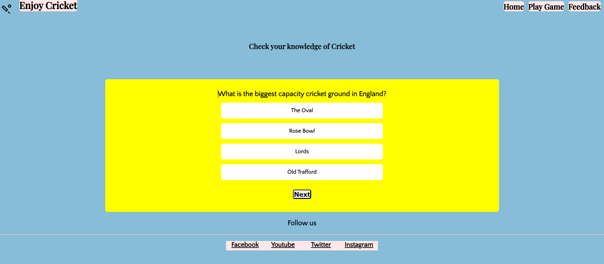
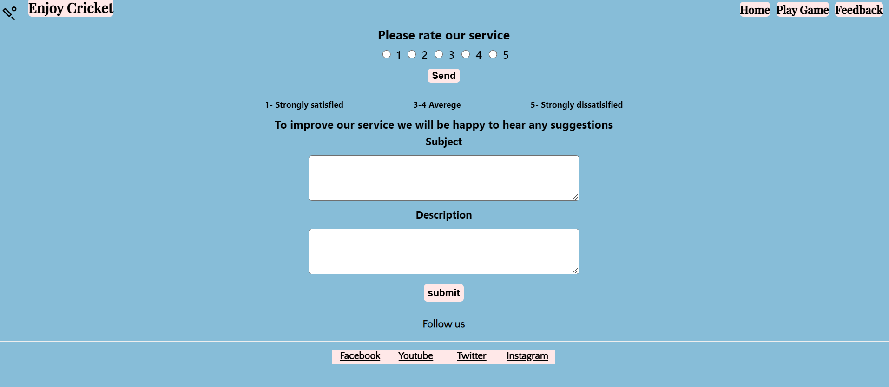
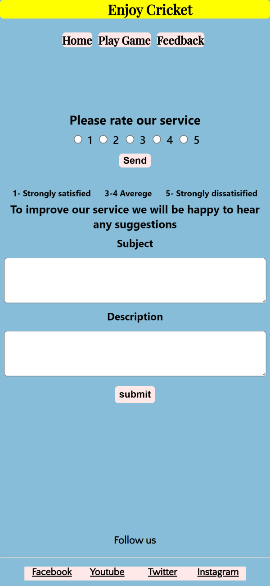
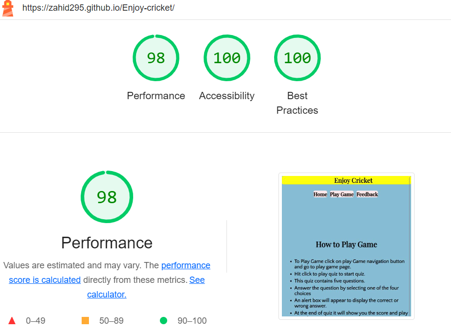

# Enjoy Cricket

The Website provides an online quiz to check cricket knowledge. It consists of three pages, home page provides information about how to play game, Game page provides questions and choices to choose from to check Cricket knowledge and Feedback page to rate the service and submit any suggestion to improve the service. It provies an interactive quiz for Cricket lovers to entertain and at the same time improve their Cricket knowledge. It is made using HTML, CSS and JavaScript.

[Click here](https://zahid295.github.io/Enjoy-cricket/) to view live project website.

## User Experience

### User Stories

##### First time user goals

- As a first time user, I want to know the purpose of website and what it offers.
- As a first time user, I want to play online Cricket quiz to entertain and check my knowledge.
- As a first time user, I want to know, how to play this online quiz.
  
##### Returner user goals

- As a returner user, I want to rate the service.
- As a returner user, I want to give review for suggesting or recommeding somthing to improve the service.
- As a returner user, I want to follow this website on social media to see if there are any updates.

### Design

##### Color Scheme

The main colors used are red, black, blue and white.

- Red may communicate a range of emotions and meanings. It is used for background because it draws attention.
- Black color improves readability. It is used for background of nav bar and also for some headings becasue black can produce an attantion grabing visual effect that will draw users in and this is the main goal of any website.
- Blue color indicates trust and people feel safe with this color. It is used for logo and some headings's background color.
- White has long been associated with purity, timelessness, elegance, and a sense of peacefulness. It is used for some paragraph text beacsue it has good contrast with red.
  
##### Typography

Two types of font are used in the website.

- Quattrocento Sans is used for paragraphs and sans-serif is used if Quattrocento Sans fails to work.
- Playfair Display is used for headings and serif is used if Playfair Display does not function.

### Wireframes

##### Landing Page

##### Play Game Page

##### Feedback page

### Features

- ##### Home page
  
  Home page, provies a clear navigation menu to follow. Below the navigation, guidelines are given that how to play game.
  
  
  
- ##### Play Game page

  It provides a way to play online cricket quiz after hitting click to play game button. As a user select and submit the multiple choice, an alert appears to show wether the selected choice was correct or incorrect and also shows the correct answer. Once all questions are completed, final score will appear and then play again button show up to play again.
  
  

  

  
  
- ##### Feedback page
  
  This page provides form to rate the service out of 5 ratings. It also shows the review form to give some suggestion or recommendation to improve the service.

  

  
  
### Technologies used

###### Languages

- HTML
- CSS
- JavaScript

##### Frameworks, Libraries and programs used

- [Codeanywhere](https://codeanywhere.com/solutions/collaborate) - Codeanywhere was used as IDE.

- [Google fonts](https://fonts.google.com/) -  Fonts for this website are from Google Fonts.
- [Git](https://git-scm.com/) - Git was used for version control.
- [Github](https://github.com/) - GitHub was used to store project.
- [Balsamiq](https://balsamiq.com/) - Wireframes were made using Balsamiq.
- [Canva](https://www.canva.com/) - Was used for image in the Website.
- [Am i Responsive](https://ui.dev/amiresponsive) - was used to see that site is responsive on different screen sizes. A screenshot is taken from Am I Responsive.
  
### Testing

All pages of the project were validated using the W3C Markup Validator and W3C CSS Validator Services to ensure there were no syntax issues.

#### HTML Validator results

##### - Home page

##### - Play Game page

##### - Feedback page

#### CSS Validator Results

#### Lighthouse tool results

##### Home page 

#### Home page mobile view

Tested on the desktop, tablet and mobile phone versions of Chrome, Opera, and Microsoft Edge.
Chrome Developer Tools are used to test responsiveness on the following devices: Desktop, and laptop, Surface Duo, iPad Air, iPad Mini, iPhone 12 Pro, iPhone XR, iPhone SE, Samsung Galaxy S8+, Samsung Galaxy S20 Ultra.

### Testing User Stories from User Experience Section

#### User story testing

##### First time user goals

1- As a first time user, I want to know the purpose of website and what it offers.

- Every page has navigation for users to quickly and easily browse the website and discover all the information they need.

2- As a first time user, I want to play online Cricket quiz to entertain and check my knowledge.

- User can easily go to play game page and start the online quiz by pressing click to play button.

3- As a first time user, I want to know, how to play this online quiz.

- User can find a guide on how to play quiz on home page where it is easily accessible.

##### Returner user goals

1- As a returner user, I want to rate the service.

- User can quickly find rate the service form on feedback page and select the number out of 5 to rate the service and then press send button to submit it.

2- As a returner user, I want to give review for suggesting or recommeding somthing to improve the service.

- User can find review submission form on feedback page to write suggestion or recommend somwthing to improve the service.

3- As a returner user, I want to follow this website on social media to see if there are any updates.

- User can find social media contact detalis in Footer area of each page.

### Common Bugs

- On the play game page before pressing click to play game button the footer comes just below click to play button in the center of page but once the click to play button is pressed the footer comes to its place in the bottom. To resolve the issue, I used an empty div to the page and give it height and width accordingly so that before pressing click to play button the footer remains in its place in the bottom.

- For the input form that appears after pressing profile button, i used model box. It was difficult to position input form in the center on different screen sizes. To overcome, i used flex box and then it stays on its place in the center.

- In HTML validation, it says heading tags are not in a sequence because i used h2 heading and immedialtely after that i used h5 to hold follow us text before footer. To resolve this issue, I change h5 heading into paragrapgh tag.

### Deployment

#### GitHub Pages

- Log into GitHub and find the repository.
- Find the Settings Button on menu at the top of Repository, not at the top of page.
- On the Settings page, scroll down until you find the GitHub Pages section.
- Click the dropdown labeled 'None' under Source and select Master Branch.
- It will refresh the page automatically.
- To find the currently published site link, scroll back down the page in the GitHub Pages section.

#### GitHub Fork

By forking the repository, we create a copy of the repository on our own account so that we can view and/or modify it without impacting the original repository by following these steps:

- Log into GitHub and find the repository.
- Find the Fork Button at the top of Repository not at the top of page, just below the Settings Button on the menu.
- By now, you should have the original repository on your GitHub account.

#### Local Clone

- Log into GitHub and find the repository.
- Click on the "Clone or Download" button under the repository name.
- For cloning the repository using HTTPS, under Clone with HTTPS, copy the link.
Start Git Bash.
- To clone the directory, replace the current working directory with the one where you want it to be created.
- Type the command git clone, and then paste the URL you copied earlier.
- Press enter to create your local clone.
